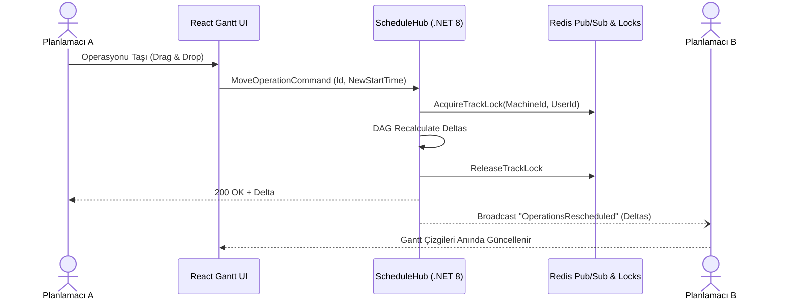

# ⚡ Real-Time SignalR & Redis Dağıtık Kilit Mimarisi

> **Kategori:** [[00-Index|Mimari]]  
> **İlgili Departmanlar:** `DEPT=backend`, `DEPT=db_dev`, `DEPT=frontend`  
> **İlgili ADR:** [[ADR-002-redis-distributed-lock]]

---

## 📡 SignalR WebSocket Akışı

Çok kullanıcılı ortamda, herhangi bir planlamacının yaptığı çizelgeleme değişikliği anında diğer tüm kullanıcılara delta olarak iletilir.

---

## 🔒 Dağıtık Kilit (Distributed Locking)

- **Anahtar Deseni:** `lock:machine:{MachineId}` veya `lock:operation:{OperationId}`
- **TTL (Zaman Aşımı):** 30 saniye (Heartbeat ile uzatılabilir).
- **Amaç:** İki kullanıcının aynı makine hattındaki operasyonları aynı anda çakışan saatlere taşımasını önlemek.
