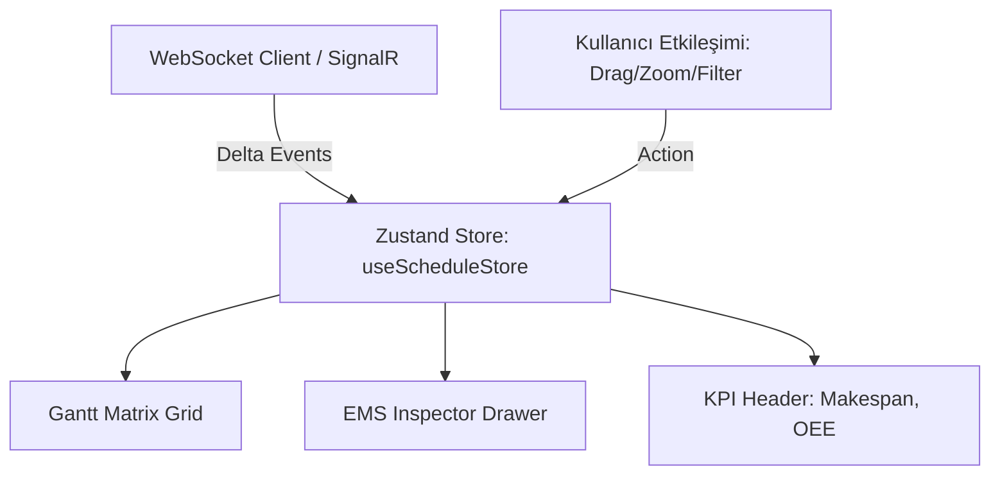

# 🎨 React 18 Gantt & Zustand State Yönetimi

> **Kategori:** [[00-Index|Mimari]]  
> **İlgili Departman:** `DEPT=frontend`  
> **Kod Dosyaları:** `frontend/src/store/useScheduleStore.ts`, `frontend/src/components/gantt/`

---

## 🧩 State Mimarisi

---

## ⚡ Performans Prensipleri
1. **Virtual Rendering:** Yalnızca görünür zaman penceresi ve makineler render edilir.
2. **Magnetic Grid Snapping:** 15 dakikalık ızgaraya manyetik yapışma.
3. **Optimistic Updates:** UI anında güncellenir, backend doğrulaması başarısız olursa geri alınır.
